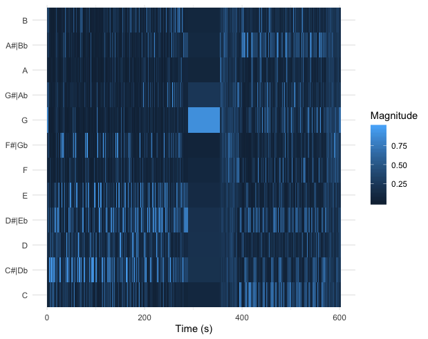

```{r setup}
# In order to use these packages, we need to install flexdashboard, plotly, and Cairo.
library(tidyverse)
library(plotly)
library(spotifyr)
source('spotify.R')
Sys.setenv(SPOTIFY_CLIENT_ID = '1c6b635c9266416ab440ffd8a81fd4f8')
Sys.setenv(SPOTIFY_CLIENT_SECRET = 'b39460500e0448fa9be025ef884d1bd2')


```

```{r}
Mellowplaylist <- get_playlist_audio_features("Amedeo Feingold", "7s6SQiFvrm81JJDJZkBkqS")
Partyplaylist <- get_playlist_audio_features("Amedeo Feingold", "1cPO0ziEsWVzO2N1MHRUD7")
head
MandP <- 
  Mellowplaylist %>% mutate(playlist = "Mellow") %>%
  bind_rows(Partyplaylist %>% mutate(playlist = "Party"))
```
    
### Chromagrams of the song with highest danceability in the Party playlist and the song with the lowest danceability in the Mellow playlist




***
These chromograms  display the scales of the songs. The chromogram indicates that Patsergedrag is writen in c minor however due to the highlighted c and Eb. However, due to the highlighted A and B, it becomes unclear whether this is really the case. Freudian seems to be on Db minor however, half way through the song it modulates to C minor. This is clearly displayed in the chromogram with the C becoming more prominant after the G. 

### TImbre SSM of Freudian


***
The SSM of Freudian is very intersting as there are clearly a few patterns which mark different stages in the song. The first pattern propagates through the graph until around 300. After this mark, the pattern is different that the previous one suggesting a clear  change in timbre. This is also clearly audible in the song 

### Comparing my party playlist and mellow playlist


***
I examined two playlists of mine that I use for different occasions, a party playlist and a mellow playlist. The party playlist mainly contains commercial hiphop but occasionally also some famous pop songs by artist such as Bruno Mars and Beyonce. The mellow playlist however, is more of an amalgam of genres as it contains jazz, hiphop, neo-soul and indie.
The sonice differences between the two playlist are obvious however I wondered whether Spotify would think the same. 
   
### Comparing the danceability of the playlists

```{r}
DandTParty <- 
    ggplot(MandP, aes(x = danceability, y = tempo, col = energy)) + geom_point() + facet_grid(.~playlist)
 
    ggplotly(DandTParty)
    
# plotting the daneabilty to the tempo of the individual playlists - with a histogram


```   

The two graphs plot the danceability against the tempo. 
    
***

The first analyses I made was based on the total average danceability of each playlist. Rather unexpectedly, the differenece was not huge, with a danceabilty ratio of 0.608 and 0.788 for the mellow and party playlist, respectively.
Secondly, I wanted see whether the difference was due to the tempo of the tracks. I computed the average tempo of each playlist through the summarize and mean functions. With a tempo of 122BPM, the party playlist surpasses the 105 BPM of the mellow playlist. This difference seemed more noticieable than the danceability ratio, thus it seems that there are multiple factors which influence danceabilty besides tempo. 
 

    
