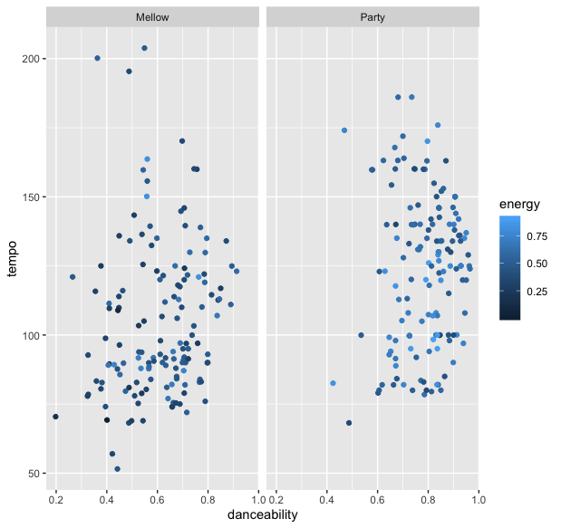
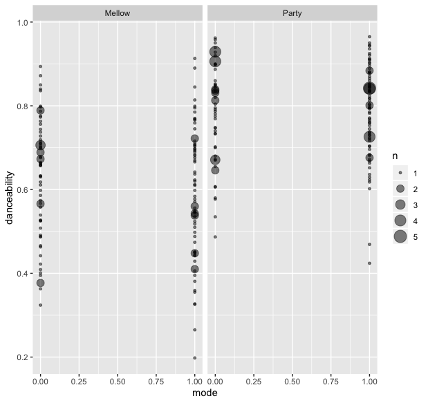

# Comparing my party playlist and mellow playlist
I examined two playlists of mine that I use for different occasions, a party playlist and a mellow playlist. The party playlist mainly contains commercial hiphop but occasionally also some famous pop songs by artist such as Bruno Mars and Beyonce. The mellow playlist however, is more of an amalgam of genres as it contains jazz, hiphop, neo-soul and indie.
The sonice differences between the two playlist are obvious however I wondered whether Spotify would think the same. 

## Findings
The first analyses I made was based on the total average danceability of each playlist. Rather unexpectedly, the differenece was not huge, with a danceabilty ratio of 0.608 and 0.788 for the mellow and party playlist, respectively.
Secondly, I wanted see whether the difference was due to the tempo of the tracks. I computed the average tempo of each playlist through the summarize and mean functions. With a tempo of 122BPM, the party playlist surpasses the 105 BPM of the mellow playlist. This difference seemed more noticieable than the danceability ratio, thus it seems that there are multiple factors which influence danceabilty besides tempo. 

### Graphs

The two graphs plot the danceability against the tempo. 

### Discussion
I did not manage to do this yet but I would like to compare the two playlists based on mode. I wonder whether the mellow playlist contains a higher amount of minor songs compared to the party playlist. I would like to make a graph which illustrates the amount of times the minor and major modes is used in each playlist. I did not manage to do this as I struggled with merging the information of playlists. 

# Week 2 - Findings

This week I dediced to analyse the factors that influence danceability. The first analyses I made in regarding danceability, tempo and energy. I tried to use the new graph functions provided to me by datacamp. The first graph showed that the danceability is as interlinked with tempo as I initially thought. This led me to analysing the mode. I wanted to know whether the danceability depended on the mode of the track (major or minor). This graph however, is still  not complete. 
At the moment it does not properly show the relationship between mode and danceability. I'm not sure what graph I should use to show the relationship. 

### Discussion

For next week, I would like to dissect the aspects of the individual playlist more. Furthermore, one of the playlist has more songs than the other which obviously has influence on the results. However, even after I created a playlist with the same amount of songs, R would upload a playlist with more songs. This is an issue that I still have to resolve. 

###Graph

# Week 4 - Findings

In order to use the recently learned chromagraphs and self-similarity matrices I decidde to chose a song from each playlist. I chose the lowest danceability song in the Mellow playlist and the highest danceability song in the Party playlist. 

###Graph

