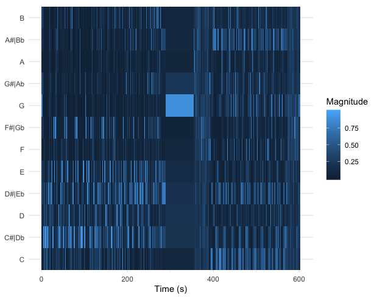
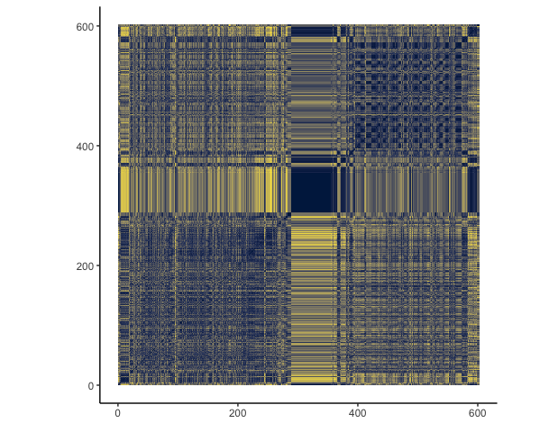

```{r setup}
# In order to use these packages, we need to install flexdashboard, plotly, and Cairo.
library(tidyverse)
library(plotly)
library(spotifyr)
source('spotify.R')
Sys.setenv(SPOTIFY_CLIENT_ID = '1c6b635c9266416ab440ffd8a81fd4f8')
Sys.setenv(SPOTIFY_CLIENT_SECRET = 'b39460500e0448fa9be025ef884d1bd2')
 
library(compmus)

```

### The confusing tempograms of Patsergedrag and Freudian 

I decided to keep researching the two songs Freudian and Patsergedrag. I used the tempograms to analyze the BPM of each song. SInce the two songs vart greatly in tempo, I was expecting a clear difference between the two tempograms. The tempo differences are definitely noticeable in graphs and the silence in Freudian is beautifully illustrated as well. Zooming in on the part after the silence however, the tempogram seems to fail. As with Patsergedrag's tempogram, it seems more constant, which was expected as the tempo is very regular. The estimated BPM's seem for both songs too high so I'm assumming that these are the tempo "overtones".

```{r}
freudiantemp <- get_tidy_audio_analysis('4nESnAOALHmxg8UFCCtXhO')

freudiantemp %>%
  tempogram(window_size = 8, hop_size = 1, cyclic = FALSE) %>% 
  ggplot(aes(x = time, y = bpm, fill = power)) + 
  geom_raster() + 
  scale_fill_viridis_c(guide = 'none') +
  labs(x = 'Time (s)', y = 'Tempo (BPM)') +
  theme_classic() + ggtitle("Tempogram of Freudian - Daniel Caesar")

patsergedragtemp <- get_tidy_audio_analysis('0jSIwy9HPtm877CHIbJHTY')

patsergedragtemp %>%
  tempogram(window_size = 8, hop_size = 1, cyclic = FALSE) %>% 
  ggplot(aes(x = time, y = bpm, fill = power)) + 
  geom_raster() + 
  scale_fill_viridis_c(guide = 'none') +
  labs(x = 'Time (s)', y = 'Tempo (BPM)') +
  theme_classic() + ggtitle("Tempogram of Patsergedrag - Sevn Alias")
```


```{r}
circshift <- function(v, n) {if (n == 0) v else c(tail(v, n), head(v, -n))}

# C     C#    D     Eb    E     F     F#    G     Ab    A     Bb    B 
major_chord <- 
  c(1,    0,    0,    0,    1,    0,    0,    1,    0,    0,    0,    0)
minor_chord <- 
  c(1,    0,    0,    1,    0,    0,    0,    1,    0,    0,    0,    0)
seventh_chord <- 
  c(1,    0,    0,    0,    1,    0,    0,    1,    0,    0,    1,    0)
major_key <- 
  c(6.35, 2.23, 3.48, 2.33, 4.38, 4.09, 2.52, 5.19, 2.39, 3.66, 2.29, 2.88)
minor_key <-
  c(6.33, 2.68, 3.52, 5.38, 2.60, 3.53, 2.54, 4.75, 3.98, 2.69, 3.34, 3.17)
chord_templates <-
  tribble(
    ~name  , ~template,
    'Gb:7'  , circshift(seventh_chord,  6),
    'Gb:maj', circshift(major_chord,    6),
    'Bb:min', circshift(minor_chord,   10),
    'Db:maj', circshift(major_chord,    1),
    'F:min' , circshift(minor_chord,    5),
    'Ab:7'  , circshift(seventh_chord,  8),
    'Ab:maj', circshift(major_chord,    8),
    'C:min' , circshift(minor_chord,    0),
    'Eb:7'  , circshift(seventh_chord,  3),
    'Eb:maj', circshift(major_chord,    3),
    'G:min' , circshift(minor_chord,    7),
    'Bb:7'  , circshift(seventh_chord, 10),
    'Bb:maj', circshift(major_chord,   10),
    'D:min' , circshift(minor_chord,    2),
    'F:7'   , circshift(seventh_chord,  5),
    'F:maj' , circshift(major_chord,    5),
    'A:min' , circshift(minor_chord,    9),
    'C:7'   , circshift(seventh_chord,  0),
    'C:maj' , circshift(major_chord,    0),
    'E:min' , circshift(minor_chord,    4),
    'G:7'   , circshift(seventh_chord,  7),
    'G:maj' , circshift(major_chord,    7),
    'B:min' , circshift(minor_chord,   11),
    'D:7'   , circshift(seventh_chord,  2),
    'D:maj' , circshift(major_chord,    2),
    'F#:min', circshift(minor_chord,    6),
    'A:7'   , circshift(seventh_chord,  9),
    'A:maj' , circshift(major_chord,    9),
    'C#:min', circshift(minor_chord,    1),
    'E:7'   , circshift(seventh_chord,  4),
    'E:maj' , circshift(major_chord,    4),
    'G#:min', circshift(minor_chord,    8),
    'B:7'   , circshift(seventh_chord, 11),
    'B:maj' , circshift(major_chord,   11),
    'D#:min', circshift(minor_chord,    3))
key_templates <-
  tribble(
    ~name    , ~template,
    'Gb:maj', circshift(major_key,  6),
    'Bb:min', circshift(minor_key, 10),
    'Db:maj', circshift(major_key,  1),
    'F:min' , circshift(minor_key,  5),
    'Ab:maj', circshift(major_key,  8),
    'C:min' , circshift(minor_key,  0),
    'Eb:maj', circshift(major_key,  3),
    'G:min' , circshift(minor_key,  7),
    'Bb:maj', circshift(major_key, 10),
    'D:min' , circshift(minor_key,  2),
    'F:maj' , circshift(major_key,  5),
    'A:min' , circshift(minor_key,  9),
    'C:maj' , circshift(major_key,  0),
    'E:min' , circshift(minor_key,  4),
    'G:maj' , circshift(major_key,  7),
    'B:min' , circshift(minor_key, 11),
    'D:maj' , circshift(major_key,  2),
    'F#:min', circshift(minor_key,  6),
    'A:maj' , circshift(major_key,  9),
    'C#:min', circshift(minor_key,  1),
    'E:maj' , circshift(major_key,  4),
    'G#:min', circshift(minor_key,  8),
    'B:maj' , circshift(major_key, 11),
    'D#:min', circshift(minor_key,  3))
```

### The chromogrma and Keygran of Patsergedrag and Freudian, repsectively


```{r}

freudianchro <- 
  get_tidy_audio_analysis('4nESnAOALHmxg8UFCCtXhO') %>% 
  compmus_align(sections, segments) %>% 
  select(sections) %>% unnest(sections) %>% 
  mutate(
    pitches = 
      map(segments, 
          compmus_summarise, pitches, 
          method = 'mean', norm = 'euclidean'))


patsergedragchro <- 
  get_tidy_audio_analysis('0jSIwy9HPtm877CHIbJHTY') %>% 
  compmus_align(sections, segments) %>% 
  select(sections) %>% unnest(sections) %>% 
  mutate(
    pitches = 
      map(segments, 
          compmus_summarise, pitches, 
          method = 'rms', norm = 'euclidean'))

freudianchro %>%
compmus_match_pitch_template(chord_templates, 'cosine', 'euclidean') %>% 
  ggplot(
    aes(x = start + duration / 2, width = duration, y = name, fill = d)) +
  geom_tile() +
  scale_fill_viridis_c(option = 'D', guide = 'none') +
  theme(plot.title = element_text(family = "Helvetica", face = "bold", size = (15))) +
  labs(x = 'Time (s)', y = '') + ggtitle("Chordgram of Freudian - Daniel Caesar")

patsergedragchro %>%
compmus_match_pitch_template(key_templates, 'manhattan', 'manhattan') %>% 
  ggplot(
    aes(x = start + duration / 2, width = duration, y = name, fill = d)) +
  geom_tile() +
  scale_fill_viridis_c(option = 'B', guide = 'none') +
  theme(plot.title = element_text(family = "Helvetica", face = "bold", size = (15))) +
  labs(x = 'Time (s)', y = '') + ggtitle("Keygram of Patsergedrag - Sevn Alias")

```

***
This week, I reused the two songs for which I made a chromogram, Freudian by Daniel Caesar and Patsergedrag by Sevn Alias. 
I analysed Freudian with a chromogram and Patsergedrag with a keygram. The reason behind this distinction is that Patsergedrag consists of a simple 8 note melody, whereas Freudian is musicly more complex, with mulitple chords, tempos and melodies. I found it however, hard to distinguish these otherwise audibel differences through the keygrams and chordgrams. This might be due to the noise which is picked up by the grams. I also tried out different colorschemes in an  attempted to highlight the differences. Despite these efforts, the key and chordgrams are not clear enough to determine the key of the songs. 


```{r}
Mellowplaylist <- get_playlist_audio_features("Amedeo Feingold", "7s6SQiFvrm81JJDJZkBkqS")
Partyplaylist <- get_playlist_audio_features("Amedeo Feingold", "1cPO0ziEsWVzO2N1MHRUD7")
head
MandP <- 
  Mellowplaylist %>% mutate(playlist = "Mellow") %>%
  bind_rows(Partyplaylist %>% mutate(playlist = "Party"))
```

### Chromagrams of the song with highest danceability in the Party playlist and the song with the lowest danceability in the Mellow playlist




***
These chromograms  display the scales of the songs. The chromogram indicates that Patsergedrag is writen in c minor however due to the highlighted c and Eb. However, due to the highlighted A and B, it becomes unclear whether this is really the case. Freudian seems to be on Db minor however, half way through the song it modulates to C minor. This is clearly displayed in the chromogram with the C becoming more prominant after the G. 

### TImbre SSM of Freudian



***
The SSM of Freudian is very intersting as there are clearly a few patterns which mark different stages in the song. The first pattern propagates through the graph until around 300. After this mark, the pattern is different that the previous one suggesting a clear  change in timbre. This is also clearly audible in the song 


### Comparing the danceability of the playlists

```{r}
DandTParty <- 
    ggplot(MandP, aes(x = danceability, y = tempo, col = energy)) + geom_point() + facet_grid(.~playlist)
 
    ggplotly(DandTParty)
    
# plotting the daneabilty to the tempo of the individual playlists - with a histogram


```   

***
The first analyses I made was based on the total average danceability of each playlist. Rather unexpectedly, the differenece was not huge, with a danceabilty ratio of 0.608 and 0.788 for the mellow and party playlist, respectively.
Secondly, I wanted see whether the difference was due to the tempo of the tracks. I computed the average tempo of each playlist through the summarize and mean functions. With a tempo of 122BPM, the party playlist surpasses the 105 BPM of the mellow playlist. This difference seemed more noticeable than the danceability ratio, thus it seems that there are multiple factors which influence danceabilty besides tempo. 

### Comparing my party playlist and mellow playlist

I examined two playlists of mine that I use for different occasions, a party playlist and a mellow playlist. The party playlist mainly contains commercial hiphop but occasionally also some famous pop songs by artist such as Bruno Mars and Beyonce. The mellow playlist however, is more of an amalgam of genres as it contains jazz, hiphop, neo-soul and indie.
The sonice differences between the two playlist are obvious however I wondered whether Spotify would think the same. 
   

 
 


